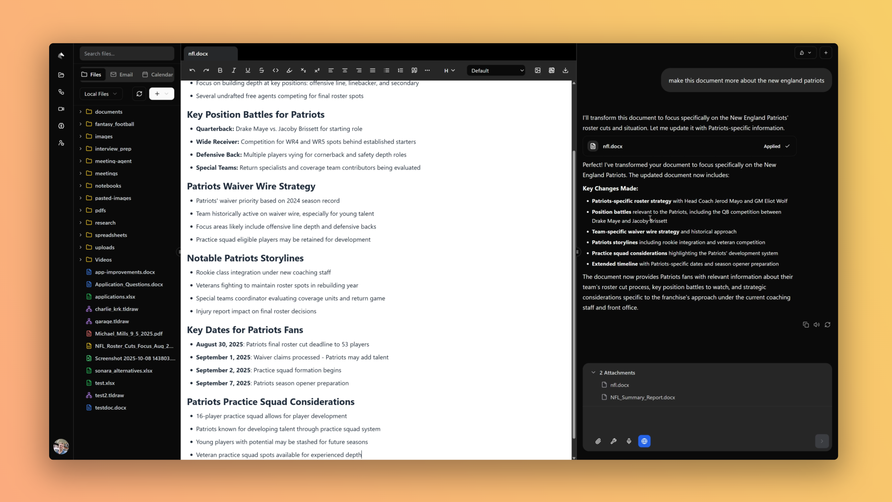

<div align="center">

# Banbury

### Your AI-Powered Workflow Engine

**Transform your business operations with intelligent automation that learns, adapts, and scales with your needs.**

[](https://nextjs.org/)
[](https://www.typescriptlang.org/)
[](https://reactjs.org/)
[](LICENSE)

</div>

---

<div align="center">



</div>

## ✨ Features

<div align="center">

### 🎯 Core Capabilities

| Feature | Description | Status |
|---------|-------------|--------|
| 🤖 **AI-Powered Automation** | Intelligent workflows that adapt and optimize | ✅ Active |
| 📧 **Email Management** | Smart categorization, routing, and AI drafts | ✅ Active |
| 📅 **Calendar Automation** | Multi-timezone scheduling and meeting management | ✅ Active |
| 📄 **Document Editing** | Rich editor with AI-enhanced capabilities | ✅ Active |
| 📊 **Spreadsheet Operations** | AI-driven data manipulation and formulas | ✅ Active |
| 🔍 **Web Search** | Advanced search with content summarization | ✅ Active |
| 💾 **AI Memory** | Persistent memory with semantic search | ✅ Active |
| ☁️ **Cloud Storage** | Unlimited file storage and management | ✅ Active |

</div>

### 🤖 AI-Powered Automation
- **Intelligent Workflows**: AI-driven automation that adapts and optimizes itself
- **Natural Language Processing**: Create workflows using simple, conversational commands
- **Smart Suggestions**: Get AI-powered recommendations for workflow optimization
- **24/7 Assistance**: Always-on AI support for your business operations

### 📧 Email Management
- **Smart Email Categorization**: Automatically organize emails by priority, sender, and content
- **AI-Powered Drafts**: Generate intelligent email responses using AI
- **Email Routing**: Automatically route emails to the right team members
- **Gmail Integration**: Full Gmail API integration with read/write capabilities

### 📅 Calendar Automation
- **Smart Scheduling**: Schedule meetings across multiple time zones automatically
- **Meeting Reminders**: Automatic reminders and follow-ups
- **Meeting Notes**: Generate and distribute meeting notes instantly
- **Google Calendar Integration**: Full calendar management with create, update, and delete operations

### 📄 Document & Spreadsheet Editing
- **Rich Document Editor**: Powered by Tiptap with AI-enhanced editing
- **Spreadsheet Operations**: AI-driven spreadsheet operations with formula support
- **Cloud Storage**: Unlimited cloud-based file storage
- **Real-time Collaboration**: Work together with your team in real-time

### 🔍 Web & Information Tools
- **Web Search**: Advanced web search with content summarization
- **Information Retrieval**: Extract and summarize information from web pages
- **Date & Time Management**: Smart scheduling and time-sensitive task handling

### 💾 Memory & Knowledge Management
- **AI Memory**: Persistent memory storage with semantic search
- **Knowledge Base**: Store and retrieve important information across sessions
- **Context Awareness**: AI remembers your preferences and past interactions

---

## 🚀 Quick Start

### Prerequisites

- Node.js 18+ 
- npm or yarn
- MongoDB (for data storage)
- AWS S3 (for file storage)

### Installation

```bash
# Clone the repository
git clone <repository-url>
cd Banbury

# Install dependencies
npm install

# Start the development server
npm run dev
```

### Production Build

```bash
# Build for production
npm run build

# Start production server
npm run start
```

---

## 🛠️ Available Commands

```bash
# Development
npm run dev              # Start development server
npm run build            # Build for production
npm run start            # Start production server

# Desktop App (Electron)
npm run desktop:dev      # Start desktop app in development mode
npm run desktop:build    # Build desktop app for production
npm run desktop:dist     # Build distributable packages for all platforms

# Code Quality
npm run lint             # Run ESLint
npm run lint:fix         # Fix linting issues
npm run format:check     # Check code formatting
npm run format:fix       # Fix code formatting
npm run types:check      # TypeScript type checking

# Storybook
npm run storybook        # Start Storybook
npm run storybook:build  # Build Storybook
npm run storybook:screenshots:ci  # Generate Storybook screenshots

# Testing
npm run test             # Run tests
npm run test:coverage    # Run tests with coverage

# Cleanup
npm run clean            # Clean build artifacts
```

---

## 📊 Key Statistics

<div align="center">

| Metric | Value | Description |
|--------|-------|-------------|
| 🚀 **Tasks Automated** | 10M+ | Total automated tasks processed |
| ⚡ **Uptime** | 99.99% | System reliability and availability |
| 💾 **Cloud Storage** | Unlimited | Free cloud storage for all users |
| 🕐 **Support** | 24/7 | Round-the-clock customer support |
| ⏱️ **Response Time** | < 100ms | Lightning-fast operation processing |
| ⏰ **Time Saved** | 20+ hrs/week | Average time saved per user |

</div>

---

## 🔌 Integrations

Banbury integrates seamlessly with your favorite tools and services:

<div align="center">

| Integration | Status | Features |
|------------|--------|----------|
| 📧 **Gmail** | ✅ Active | Read/Write emails, Search, Drafts |
| 📅 **Google Calendar** | ✅ Active | Create/Update/Delete events, Scheduling |
| 📝 **Google Docs** | ✅ Active | Document editing and collaboration |
| 📊 **Google Sheets** | ✅ Active | Spreadsheet operations and formulas |
| 📮 **Outlook** | ✅ Active | Email management |
| 💬 **Slack** | ✅ Active | Team communication |
| 💻 **GitHub** | ✅ Active | Code repository management |
| 🎥 **Zoom** | ✅ Active | Video conferencing |
| 🎬 **Google Meet** | ✅ Active | Video meetings |

</div>

---

## 🤖 Agent Tools

The AI agent has access to a comprehensive set of tools for various tasks:

### 🌐 Web & Information Tools

#### Web Search
- **`web_search`**: Search the web and read page content for summaries
  - Uses Tavily API for high-quality results with fallback to DuckDuckGo
  - Enriches results by fetching and parsing page content
  - Returns structured results with titles, URLs, and snippets

#### Date & Time
- **`get_current_datetime`**: Get current date and time information
  - Returns formatted date/time strings, timestamps, and individual components
  - Useful for scheduling, planning, and time-sensitive tasks

### 📝 Document & Content Tools

#### Document Editor Integration
- **`tiptap_ai`**: Deliver AI-generated content to the Tiptap document editor
  - Supports actions: rewrite, correct, expand, translate, summarize, outline, insert
  - Formats responses for direct integration with the editor
  - Handles text selection and modification tracking

#### Spreadsheet Editor Integration
- **`sheet_ai`**: Apply AI-driven spreadsheet operations
  - Cell operations: set individual cells or ranges
  - Row/column management: insert, delete rows and columns
  - Data transformations: cleaning, normalization, formula application
  - Full CSV content replacement option

### 📁 File Management Tools

#### File Creation & Upload
- **`create_file`**: Create new files in the user's cloud workspace
  - Supports multiple file types: HTML, Markdown, CSV, JSON, plain text
  - Automatic content type detection and formatting
  - Markdown to HTML conversion with full formatting support
  - File path management with parent directory structure

#### File Download
- **`download_from_url`**: Download files from URLs to cloud workspace
  - Automatic file type detection from MIME types
  - Custom file naming and path options
  - Integration with S3 storage backend

#### File Search
- **`search_files`**: Search for files in cloud storage
  - Case-insensitive search by file name
  - Returns file metadata and location information

### 🧠 Memory Management Tools

#### Memory Storage
- **`store_memory`**: Store important information in user's memory
  - Integrated with Zep Cloud and Mem0 for persistent storage
  - Supports different data types and overflow strategies
  - Session-based memory organization

#### Memory Search
- **`search_memory`**: Search through user's stored memories
  - Semantic search across previous conversations and interactions
  - Multiple search scopes: nodes (entities/concepts) and edges (relationships/facts)
  - Advanced reranking options for better relevance

### 📧 Email Tools (Gmail Integration)

#### Email Reading
- **`gmail_get_recent`**: Get recent Gmail messages from inbox
  - Returns message metadata, content, and attachments
  - Automatic content truncation to prevent token limits
  - Configurable label filtering

- **`gmail_search`**: Search Gmail using Gmail search syntax
  - Supports queries like `from:john@example.com`, `subject:meeting`, `is:unread`
  - Time-based filtering with `after:` and `before:` operators

- **`gmail_get_message`**: Get specific Gmail message by ID
  - Full message content retrieval
  - Thread context and attachment information

#### Email Sending
- **`gmail_send_message`**: Send emails or create drafts
  - Support for CC and BCC recipients
  - HTML body content support
  - Draft creation option for review before sending

### 📅 Calendar Tools (Google Calendar Integration)

#### Calendar Reading
- **`calendar_list_events`**: List calendar events with filtering
  - Time range filtering with RFC3339 timestamps
  - Query-based search within events
  - Pagination support for large result sets
  - Recurring event expansion options

- **`calendar_get_event`**: Get specific calendar event by ID
  - Full event details including attendees, location, and description

#### Calendar Management
- **`calendar_create_event`**: Create new calendar events
  - Full Google Calendar API event payload support
  - Multi-calendar support with calendar ID specification

- **`calendar_update_event`**: Update existing calendar events
  - Partial event updates with flexible payload structure

- **`calendar_delete_event`**: Delete calendar events
  - Event removal with optional calendar specification

### ⚙️ Tool Preferences

The agent respects user tool preferences that can be configured to enable/disable specific integrations:
- Gmail access can be disabled via `toolPreferences.gmail`
- Calendar access can be disabled via `toolPreferences.calendar`

---

## 🏗️ Technical Architecture

### Core Technologies

- **Framework**: Next.js 14 with React 18
- **Language**: TypeScript 5.9
- **Styling**: Tailwind CSS with Radix UI components
- **AI Framework**: LangGraph for multi-step reasoning
- **Agent Pattern**: React-style agent for tool-calling loops

### Key Features

- ✅ **LangGraph Integration**: Sophisticated multi-step reasoning
- ✅ **React Agent Pattern**: Tool-calling loops with state management
- ✅ **Error Handling**: Comprehensive error handling with graceful fallbacks
- ✅ **Token Management**: Automatic content truncation to prevent token limit issues
- ✅ **Authentication**: Secure token-based authentication for all API calls
- ✅ **Rate Limiting**: Built-in protection against API rate limits

### Project Structure

```
Banbury/
├── packages/
│   ├── frontend/          # React frontend application
│   ├── backend/           # Backend API services
│   ├── electron-app/      # Electron desktop shell (optional)
│   └── public/            # Static assets and images
├── Dockerfile             # Docker configuration
├── package.json          # Root package configuration
└── README.md            # This file
```

---

## 🖥️ Desktop App (Electron)

Banbury is also available as a cross-platform desktop application for Windows, macOS, and Linux. The desktop app is a thin Electron shell that loads the web application, providing a native desktop experience.

### Prerequisites

- Node.js 18+
- npm
- For building platform-specific distributables:
  - **Windows**: No additional requirements
  - **macOS**: Xcode Command Line Tools (`xcode-select --install`)
  - **Linux**: `rpm`, `dpkg`, or `snapcraft` depending on target format

### Desktop Development

```bash
# Navigate to packages directory
cd packages

# Install dependencies (includes Electron)
npm install

# Run the desktop app in development mode
# This starts the Next.js dev server and launches Electron
npm run desktop:dev
```

### Building Desktop Distributables

```bash
# Build the desktop app for your current platform
npm run desktop:build

# Build and create distributable packages (Windows, macOS, Linux)
npm run desktop:dist
```

### Desktop Environment Variables

| Variable | Description | Default |
|----------|-------------|---------|
| `DESKTOP_APP_DEV_URL` | URL for development mode | `http://localhost:3000` |
| `DESKTOP_APP_PROD_URL` | URL for production mode | Deployed web app URL |

### Desktop App Features

- 🪟 **Native Window**: Runs in its own window with standard OS controls
- 🔒 **Secure**: Context isolation enabled, no Node.js access from renderer
- 🔄 **Auto Updates**: (Coming soon) Automatic updates for desktop users
- 💻 **Cross-Platform**: Single codebase for Windows, macOS, and Linux

---

## 📊 Use Cases

### 💼 Business Automation
- Automate email responses and categorization
- Schedule and manage meetings automatically
- Generate reports and distribute to stakeholders
- Sync data across multiple platforms

### 📈 Productivity Enhancement
- Reduce manual work by up to 80%
- Process thousands of operations per second
- Save 20+ hours per week on repetitive tasks
- < 100ms response time for real-time operations

### 🤝 Team Collaboration
- Real-time document editing
- Shared workspaces and file management
- Automated task assignment and tracking
- Intelligent workflow suggestions

---

## 🔒 Security & Privacy

- **Secure Authentication**: Token-based authentication for all API calls
- **Data Encryption**: All data encrypted in transit and at rest
- **Privacy Controls**: Configurable tool preferences for data access
- **Rate Limiting**: Protection against API abuse and rate limits

---

## 📚 Documentation

- [API Documentation](packages/public/Banbury_API.yaml) - OpenAPI specification
- [Features Page](/features) - Detailed feature documentation
- [Terms of Use](/terms_of_use) - Terms and conditions
- [Privacy Policy](/privacy_policy) - Privacy policy

---

## 🤝 Contributing

We welcome contributions! Please feel free to submit a Pull Request.

1. Fork the repository
2. Create your feature branch (`git checkout -b feature/AmazingFeature`)
3. Commit your changes (`git commit -m 'Add some AmazingFeature'`)
4. Push to the branch (`git push origin feature/AmazingFeature`)
5. Open a Pull Request

---

## 📄 License

This project is licensed under the MIT License - see the [LICENSE](LICENSE) file for details.

---

## 🙏 Acknowledgments

- Built with [Next.js](https://nextjs.org/)
- UI components from [Radix UI](https://www.radix-ui.com/)
- AI powered by [LangGraph](https://github.com/langchain-ai/langgraph)
- Icons from [Heroicons](https://heroicons.com/)

---

<div align="center">

**Made with ❤️ by the Banbury Team**

[Website](https://banbury.ai) • [Documentation](https://docs.banbury.ai) • [Support](https://support.banbury.ai)

</div>
